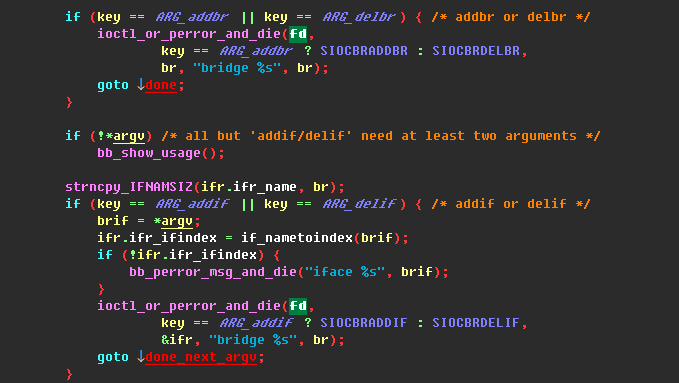
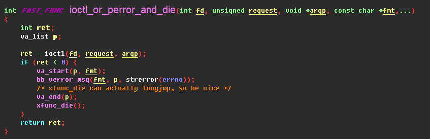

# Brctl 工作原理简单梳理

## Application Layer
source code path: busybox




```
ioctl(fd, SIOCBRADDBR , argp); 89A0
ioctl(fd, SIOCBRDELBR , argp); 89A1
ioctl(fd, SIOCBRADDIF , argp); 89A2
ioctl(fd, SIOCBRDELIF , argp); 89A3
```
***
## Kernel Layer
### Add bridge
```
do_vfs_ioctl 
-->sock_ioctl
-->br_ioctl_hook  <--> br_ioctl_deviceless_stub
-->br_add_bridge || br_del_bridge
-->register_netdev || br_dev_delete
```
### Add interface
```
do_vfs_ioctl
-->sock_ioctl
-->sock_do_ioctl
-->sock->ops->ioctl(sock, cmd, arg)
-->br_netdev_ops->.ndo_do_ioctl
-->br_dev_ioctl
-->add_del_if
-->br_add_if || br_del_if
-->netdev_rx_handler_register(dev, br_handle_frame, p)
-->rcu_assign_pointer(dev->rx_handler, rx_handler);
```