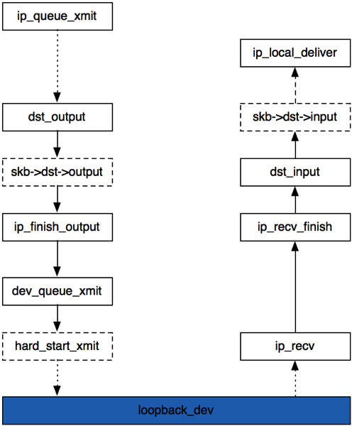

# Loop back Introdcution

## Loop back Basic Introduction
Linux support Loopback Interface in order to let client communicate with same host's server.
A series netwrok 127 is prepared for loopback interface. Usually, most system will allocate
127.0.0.1 to loopback interface, and name it as localhost.
## Linux Implementation
### Two route table
There are tow default table. One is for local route, and the other is for main route.
When Linux starts to route lookup, Linux will loop up local route table and then main route table.
```
static inline int fib_lookup(const struct flowi *flp, struct fib_result *res)
{
	if (ip_fib_local_table->tb_lookup(ip_fib_local_table, flp, res) &&
		ip_fib_main_table->tb_lookup(ip_fib_main_table, flp, res))
			return -ENETUNREACH; 
	return 0;
}
```

If Linux kernel thinks this target IP as localhost, Kernel will set the output device as loopbakc_dev.
```
static int ip_route_output_slow(struct rtable **rp, const struct flowi *oldflp)
{
	if (res.type == RTN_LOCAL) {
		if (!fl.fl4_src) 	fl.fl4_src = fl.fl4_dst;
		if (dev_out)  dev_put(dev_out);
		dev_out = &loopback_dev;
		dev_hold(dev_out);
		
	}
}
```

### The whole process flow
