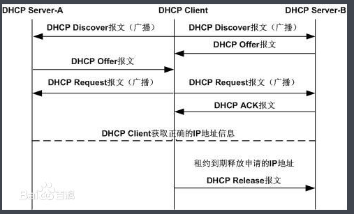

# DHCP Introduction
## DHCP Open Server
http://linux.softpedia.com/get/Internet/DNS/Open-DHCP-Server-46442.shtml 

## DHCP Protocol
**DHCP protocol is based on UDP protocol. DHCP Clinet will send dhcp request to udp port 67, meanwhileDHCP Server will give the related response message throught UDP port 68.**

- DHCP Client will send one DHCP Discvoer packet throught broadcast style.
- All DHCP servers will receive the DHCP Client's DHCP Discover packet, and all DHCP Server 
will give one response, Send one DHCP OFFER PACKET.
- In DHCP Offer packet, there is one segment named "Your IP Address". This segment is IP address
which DHCP server provide for DHCP Client. Meanwhile DHCP server will put its own IP address into 
option segment.
- DHCP Client will handle only one DHCP Offer packet. The common policy is that DHCP Client will handle
the first DHCP Offer it received.
- DHCP Client will send one DHCP Request broadcast packet, and option segment will be marked with DHCP 
Server's IP address.
- When DHCP Server receive one DHCP Request, will check option segment's IP Address. If this IP address
is the same as itself, DHCP Server will send one DHCP ACK packet to DHCP Client.
