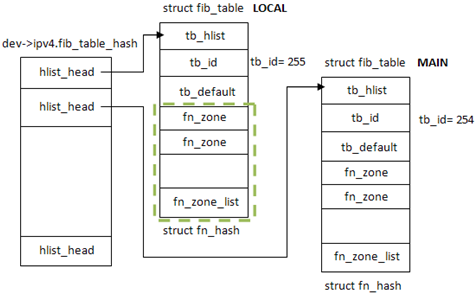

# Route  (Linux 2.6)
In ip_route_input, we will check route cache at first. If matched, we will get the destination, otherwise. we will check the whole route table. 
## Route Cache
***
### Route cache Create
```c
int __init ip_rt_init(void)
{
	int rc = 0;

#ifdef CONFIG_NET_CLS_ROUTE
	ip_rt_acct = __alloc_percpu(256 * sizeof(struct ip_rt_acct), __alignof__(struct ip_rt_acct));
	if (!ip_rt_acct)
		panic("IP: failed to allocate ip_rt_acct\n");
#endif

	ipv4_dst_ops.kmem_cachep =
		kmem_cache_create("ip_dst_cache", sizeof(struct rtable), 0,
				  SLAB_HWCACHE_ALIGN|SLAB_PANIC, NULL);

	ipv4_dst_blackhole_ops.kmem_cachep = ipv4_dst_ops.kmem_cachep;

	rt_hash_table = (struct rt_hash_bucket *)
		alloc_large_system_hash("IP route cache",
					sizeof(struct rt_hash_bucket),
					rhash_entries,
					(totalram_pages >= 128 * 1024) ?
					15 : 17,
					0,
					&rt_hash_log,
					&rt_hash_mask,
					rhash_entries ? 0 : 512 * 1024);
	memset(rt_hash_table, 0, (rt_hash_mask + 1) * sizeof(struct rt_hash_bucket));
	rt_hash_lock_init();
  ...
}
```
***
### Route cache add one entry
The reason why we need to add one entry: We need to route one destination and cannot find one cache for this case, and after we get the route info from route table, we need to consider to add the info to route cache.
```c
static int ip_route_input_slow(struct sk_buff *skb, __be32 daddr, __be32 saddr,
			       u8 tos, struct net_device *dev)
{
  local_input:
	rth = dst_alloc(&ipv4_dst_ops);
	if (!rth)
		goto e_nobufs;

	rth->u.dst.output= ip_rt_bug;
	rth->u.dst.obsolete = -1;
	rth->rt_genid = rt_genid(net);

	atomic_set(&rth->u.dst.__refcnt, 1);
	rth->u.dst.flags= DST_HOST;
	if (IN_DEV_CONF_GET(in_dev, NOPOLICY))
		rth->u.dst.flags |= DST_NOPOLICY;
	rth->fl.fl4_dst	= daddr;
	rth->rt_dst	= daddr;
	rth->fl.fl4_tos	= tos;
	rth->fl.mark    = skb->mark;
	rth->fl.fl4_src	= saddr;
	rth->rt_src	= saddr;
#ifdef CONFIG_NET_CLS_ROUTE
	rth->u.dst.tclassid = itag;
#endif
	rth->rt_iif	=
	rth->fl.iif	= dev->ifindex;
	rth->u.dst.dev	= net->loopback_dev;
	dev_hold(rth->u.dst.dev);
	rth->idev	= in_dev_get(rth->u.dst.dev);
	rth->rt_gateway	= daddr;
	rth->rt_spec_dst= spec_dst;
	rth->u.dst.input= ip_local_deliver;
	rth->rt_flags 	= flags|RTCF_LOCAL;
	if (res.type == RTN_UNREACHABLE) {
		rth->u.dst.input= ip_error;
		rth->u.dst.error= -err;
		rth->rt_flags 	&= ~RTCF_LOCAL;
	}
	rth->rt_type	= res.type;
	hash = rt_hash(daddr, saddr, fl.iif, rt_genid(net));
	err = rt_intern_hash(hash, rth, NULL, skb, fl.iif);
  
}
```
```c
static int rt_intern_hash(unsigned hash, struct rtable *rt,
			  struct rtable **rp, struct sk_buff *skb, int ifindex)
{
  ...
    rt->u.dst.rt_next = rt_hash_table[hash].chain;    // rt_hash_table is cache table, we add rt to the related busket chain's head.
   rcu_assign_pointer(rt_hash_table[hash].chain, rt);
}
```
***
## Route table create

```c
static int __net_init fib_net_init(struct net *net)
{
	int error;

	error = ip_fib_net_init(net);

	goto out;
}
static int __net_init ip_fib_net_init(struct net *net)
{
	int err;
	unsigned int i;

	net->ipv4.fib_table_hash = kzalloc(
			sizeof(struct hlist_head)*FIB_TABLE_HASHSZ, GFP_KERNEL);
	if (net->ipv4.fib_table_hash == NULL)
		return -ENOMEM;

	for (i = 0; i < FIB_TABLE_HASHSZ; i++)
		INIT_HLIST_HEAD(&net->ipv4.fib_table_hash[i]);

	err = fib4_rules_init(net);
	if (err < 0)
		goto fail;
	return 0;

fail:
	kfree(net->ipv4.fib_table_hash);
	return err;
}
```
```c
ip_rcv_finish
-->ip_route_input

int ip_route_input(struct sk_buff *skb, __be32 daddr, __be32 saddr,
		   u8 tos, struct net_device *dev)
{
	struct rtable * rth;
	unsigned	hash;
	int iif = dev->ifindex;
	struct net *net;

	net = dev_net(dev);

	if (!rt_caching(net))
		goto skip_cache;

	tos &= IPTOS_RT_MASK;
	hash = rt_hash(daddr, saddr, iif, rt_genid(net));

	rcu_read_lock();
	for (rth = rcu_dereference(rt_hash_table[hash].chain); rth;
	     rth = rcu_dereference(rth->u.dst.rt_next)) {
		if (((rth->fl.fl4_dst ^ daddr) |
		     (rth->fl.fl4_src ^ saddr) |
		     (rth->fl.iif ^ iif) |
		     rth->fl.oif |
		     (rth->fl.fl4_tos ^ tos)) == 0 &&
		    rth->fl.mark == skb->mark &&
		    net_eq(dev_net(rth->u.dst.dev), net) &&
		    !rt_is_expired(rth)) {
			dst_use(&rth->u.dst, jiffies);
			RT_CACHE_STAT_INC(in_hit);
			rcu_read_unlock();
			skb_dst_set(skb, &rth->u.dst);
			return 0;
		}
		RT_CACHE_STAT_INC(in_hlist_search);
	}
	rcu_read_unlock();
  ...
    return ip_route_input_slow(skb, daddr, saddr, tos, dev);  // once the rt cache isn't matched, we need to check the whole route table.
}
```
